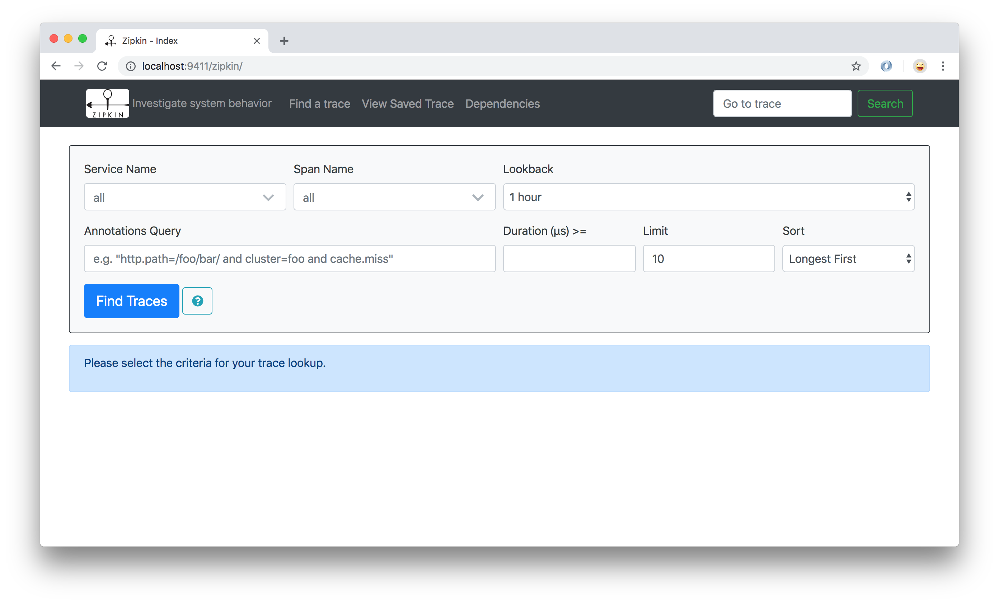
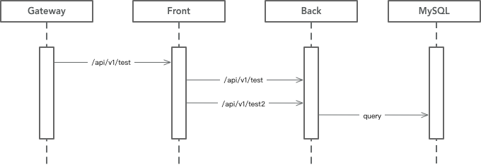
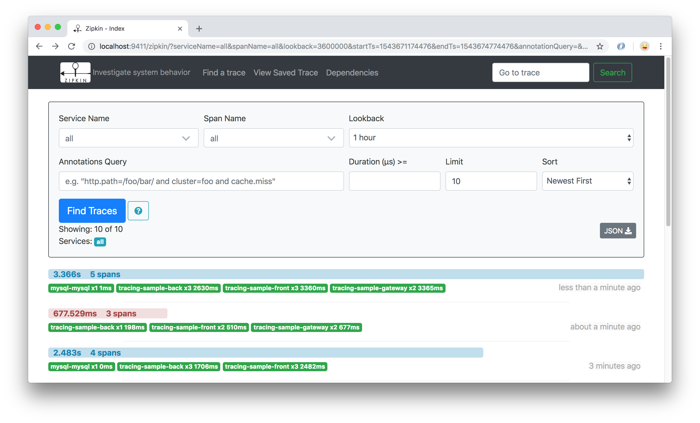
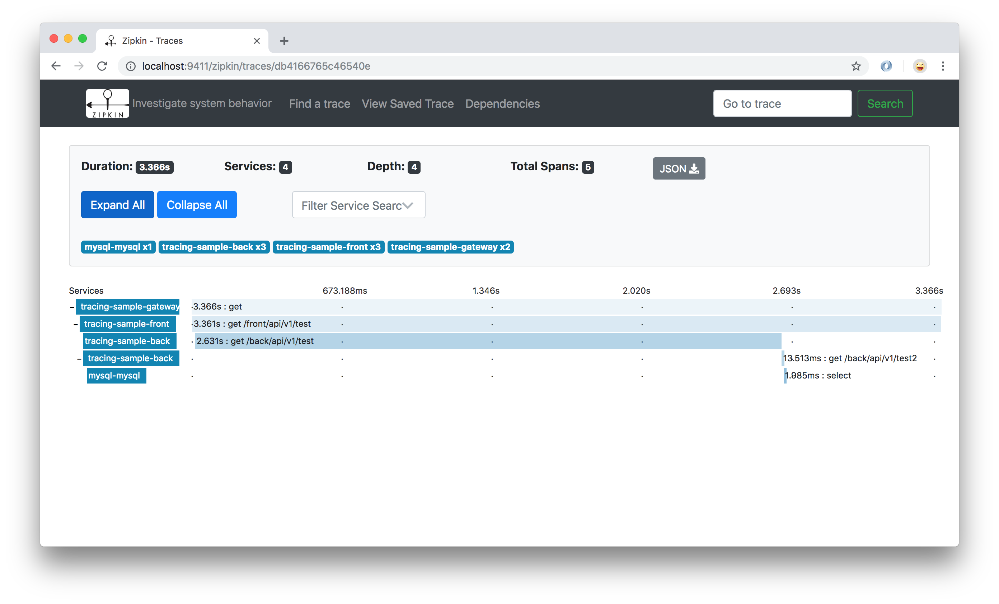
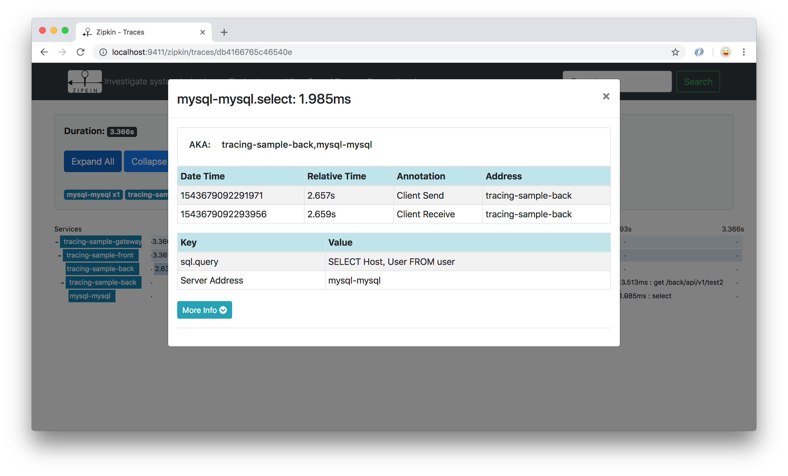

# spring-boot-tracing-sample

Tracing 是跟踪分布式系统执行过程的技术。一次服务调用要经过多个服务的处理才能完成，当服务延时或者出错的时候，要想知道是由哪个后端服务引起的，就要采用跟踪手段。Zipkin 是一个分布式跟踪系统，可以收集请求的执行数据，展示一个请求经过了哪些程序，以及每个程序占用的时间，方便我们寻找延时的服务，定位性能问题和故障。Brave 是 Zipkin 的客户端收集器，封装了 Trace、Span 等数据结构，向 Zipkin Web API 上传数据，并且对特定的调用提供了埋点工具，比如 HttpClient、MySQL 查询。

Tracing 可以看做一种特殊的日志，比起普通的日志，跟踪日志具有关联性，需要在多次请求之间记录关联编号和调用层级。以 HTTP 调用为例，Zipkin 在 HTTP 请求上添加了 4 个与跟踪有关的消息头：

```shell
x-b3-sampled: 1
x-b3-traceid: 5e4d37c7ca8a3e0c
x-b3-spanid: ce2302d30d53088
x-b3-parentspanid: 5e4d37c7ca8a3e0c
```

Brave 根据这几个消息头，收集相关的信息上传到 Zipkin，实现服务跟踪。

与日志相似，Tracing 也需要采取某种方式控制数据量。在一个访问量很大的系统上，跟踪所有的请求是没有必要的，也会浪费巨大的存储和网络资源。Zipkin 使用采样（Sampler）方式控制采集比例。


## 启动 Zipkin

先下载一个 Zipkin，寻找最新的 exec 版本，比如 `zipkin-server-2.11.8-exec.jar`. 下载地址：

https://dl.bintray.com/openzipkin/maven/io/zipkin/java/zipkin-server/

Zipkin 自带 InMemory 存储。实际使用一定要采用外部存储，可以使用 Elasticsearch 或者 MySQL。Elasticsearch 更适合大规模使用，启动命令：

```
java -jar zipkin-server-2.11.8-exec.jar --STORAGE_TYPE=elasticsearch \
    --ES_HOSTS=localhost:9200
```

启动之后可以在 `9411` 端口看到 Zipkin 的界面，推荐使用 Chrome 浏览器：



## 示例程序结构

示例程序由 3 个包构成：

- `gateway` 是服务网关，使用 Zuul 实现。示例程序说明了在 Zuul 中集成 Zipkin 的方法。服务网关是外部客户调用服务的门户。如果你的集群对外提供很多服务，现在开始做服务跟踪，从网关开始是一个好办法；

- `front` 是前端服务，提供 `/front/api/v1/test`，对 `back` 服务发起了两次调用，自己也做了一个耗时操作；

- `back` 是后端服务，提供 `/back/api/v1/test` 和 `/back/api/v1/test2` 接口，演示了 MySQL 数据查询的跟踪方法。

整体调用时序如下：



## 集成 Sleuth + Zipkin

示例程序用 Spring Boot 开发，集成 Sleuth 实现 Zipkin 数据收集。示例程序演示了最基本的集成方法，添加依赖项，使用 Starter：

```xml
<dependency>
	<groupId>org.springframework.cloud</groupId>
	<artifactId>spring-cloud-starter-sleuth</artifactId>
</dependency>
<dependency>
	<groupId>org.springframework.cloud</groupId>
	<artifactId>spring-cloud-starter-zipkin</artifactId>
</dependency>
```

在配置文件中添加以下项目，也可以在启动参数中添加：

```shell
spring.sleuth.web.client.enabled=true
spring.sleuth.sampler.probability=1.0
spring.zipkin.enabled=true
spring.zipkin.base-url=http://localhost:9411
```

设置 Zipkin 地址和采样比例，设置成 `1.0` 意味着全部采集。

对于 MySQL 访问，Brave 已经提供了埋点拦截器，添加依赖：

```xml
<dependency>
	<groupId>io.zipkin.brave</groupId>
	<artifactId>brave-instrumentation-mysql</artifactId>
	<version>5.1.0</version>
</dependency>
```

数据库连接参数稍作修改，加上拦截器设置：

```shell
spring.datasource.url=jdbc:mysql://localhost:3306/mysql?useSSL=false&statementInterceptors=brave.mysql.TracingStatementInterceptor
```

## 运行

程序打包：

```shell
mvn package
```

运行程序：

```shell
java -jar gateway/target/tracing-sample-gateway-1.0.0-SNAPSHOT.jar

java -jar front/target/tracing-sample-front-1.0.0-SNAPSHOT.jar \
    --back.url=http://localhost:8082

java -jar back/target/tracing-sample-back-1.0.0-SNAPSHOT.jar
```

> `front` 程序直接访问 `back` 端口，不使用网关。网关一般只用在集群的入口位置，提供给外界用户调用。在集群内部要提供某种服务发现机制，进程之间直接访问，尽量减少调用环节，降低延时。大量采用网关会带来单点故障的风险，甚至造成雪崩效应。

验证一下程序的功能：

```shell
$ curl -i 'http://localhost:8080/front/api/v1/test'
HTTP/1.1 200
Content-Type: text/plain;charset=UTF-8
Content-Length: 103
Date: Sat, 01 Dec 2018 15:42:46 GMT

Message from backend: ["Hello, sleep time: 1509", "[{Host=%, User=root}, {Host=localhost, User=root}]"]
```

`back` 程序中做了一个随机数，有 10% 的概率会抛出异常，如果运气好的话你会看到一个。

在 Zipkin 界面上可以跟踪最近发生的请求：



可以查看每个服务的时间消耗，发现慢节点：



查看服务的细节，包括请求时间、返回时间，标签信息（比如 http.path, sql.query）：




